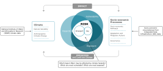

```{r setup, include=FALSE} 
knitr::opts_chunk$set(warning = FALSE, message = FALSE)
idi_link <-
  "https://www.stats.govt.nz/integrated-data/integrated-data-infrastructure/"
niwa_link <-
  "https://niwa.co.nz/"
nccra_link <-
  paste0(
    "https://environment.govt.nz/publications",
    "/national-climate-change-risk-assessment-for-new-zealand-main-report/"
  )
```

### Background

The primary objective of this study and its accompanying data tool is to assess
the resilience of Māori communities in response to climate change. Climate
change is attributed to both natural factors and changes resulting from human
behaviour, leading to climate hazards such as sea level rise and extreme heat
events. These hazards are projected to escalate in the future, and communities
face varying degrees of exposure depending on their geographical location. The
risk of adverse impacts arises from both climate-related hazards and the
vulnerability and exposure of communities. Our research focuses on the
interaction between these two factors, depicted as the white intersection area
in the middle of the schematic, where we investigate the exposure of Māori
communities to projected climate hazards in relation to their current
socio-economic circumstances.

<figure style="display:table;" class="img-right">
  
  <figcaption>
  <span style='color:#007c9d;'>Figure: </span>
  The schematic, based on Figure 19-1 in Emergent Risks and Key Vulnerabilities
  (Impacts, Adaptation, and Vulnerability. Part A, p. 1039-1099), by Oppenheimer
  et al., 2014, Cambridge University Press, has served as the methodological
  framework for this project. In this initial exploratory phase, we do not
  consider adaptation and mitigation actions/plans, governance, or changes in
  community resilience over time.
  </figcaption>
</figure>

### Climate Hazards
We focused on climate hazards projected to have the most substantial and
immediate impact on human lives based on the identification of significant risks
to human wellbeing outlined in the 2020 National Climate Change Risk Assessment
<a href=`r nccra_link` target="_blank">report</a> published by the Ministry for
the Environment (MfE). These hazards include floods, sea level rise,
and changes in the frequency of heatwaves, extreme hot days, wet spells,
extreme rainfall, and droughts. The climate hazard information is based on
datasets provided by the National Institute of Water and Atmospheric Research
<a href=`r niwa_link` target="_blank">(NIWA)</a>. We obtained climate datasets
for both a baseline period from 1986 to 2005 and projected changes averaged over
the period from 2031 to 2050 (mid-century). Except for the flood data, all the
climate indicators presented in this tool are based on mid-century projections.
These projections are mostly based on a low-moderate global emission trajectory
called Representative Concentration Pathways 4.5 (RCP 4.5), developed by the
Intergovernmental Panel on Climate Change (IPCC) and used in global climate
models.

For this study, we have aggregated climate data to the 2022 Statistical Area
(SA2) geographical divisions. The SA2 geography, typically inhabited by 1,000
to 4,000 residents, is designed to reflect communities that interact socially
and economically. We opted for SA2 over a smaller geographic area to ensure that
a comprehensive set of descriptive characteristics about households and
communities can be derived from the Integrated Data Infrastructure (IDI).

The majority of climate data, excluding sea level rise, was provided in the
form of spatial grid (raster) files. To transform this data to the SA2 level,
we extracted the maximum value of each climate variable within the SA2 area.
Sea level rise data was supplied as shapefiles, which we overlaid with SA2s and
summarised to calculate the area of overlap per layer. It is important to note
that the climate data does not fully cover all the SA2s. For our exploratory
analysis, we imputed climate data for these missing areas (except for the
Chatham Islands) by referencing the nearest SA2 area with non-missing climate
data.

The climate indicators used in this study are briefly discussed below.

<h4 style="color:#007c9d;">
  
  Floods
</h4>

Flooding has significant direct and indirect impacts on people's health and
wellbeing. Floods can cause extensive physical damage to employment sites,
personal property, and critical infrastructure, including homes, roads, and
utilities. Our research focused on examining areas prone to flooding by using
composite flood hazard area maps provided by regional and district councils to
NIWA. These maps were created from modelled and historic flood hazard maps and
flood-prone soil maps, publicly available in August 2018. There are no future
projections available at this stage, although work is underway to produce these
in the next couple of years. The flood data in this tool is represented as a
percentage of an area that is either known or potentially flood-prone land.
The data is organised into twenty levels, each spanning a 5% width. The pivot
table presents flood information in levels with a width of 10%. In some cases,
categories with lower counts may have been combined in the maps or tables.

<h4 style="color:#007c9d;">
  
  Wet Spells
</h4>

In this work, a wet spell is defined as a period of five consecutive days
during which the total daily rainfall exceeds 1 mm. The wet spells can have both
direct and indirect adverse health effects, such as increased mould growth in
housing due to prolonged dampness, contamination of drinking water sources, and
reduced mental health stemming from decreased exposure to sunlight. The wet
spell data in this tool is represented by the number of days per year that
fall within a wet spell - defined as previously described. The data is
categorised into levels with a width of twenty days. In some cases, categories
with lower counts may have been combined in the maps or tables.

<h4 style="color:#007c9d;">
  
  Extreme Rainfall
</h4>

Extreme rainfall is expected to rise as a result of climate change, driven by
the capacity of a warmer atmosphere to retain greater moisture. These intense
rain events are often linked to storms and can significantly impact people and
communities by causing hazards such as flooding, landslides, and damage to
buildings and infrastructure. In this tool, extreme rainfall is defined as the
number of days per year when rainfall exceeds 30 mm in a day. The indicator is
categorised into five-day bins in the pivot table, and ten-day bins in the maps
and location insights. Some categories may have been merged due to low counts.

<h4 style="color:#007c9d;">
  
  Heatwave
</h4>

A heatwave is characterised by sustained and significantly higher
temperatures than the usual climate values of a specific location. Global
warming has contributed to the increased frequency and intensity of
heatwaves worldwide. Heatwaves often occur alongside other climate
hazards, such as droughts and wildfires. The impacts of heatwaves include
social, environmental, and economic dimensions, including surge in heat-related
deaths, pressure on water and energy resources, and challenges to food and
livelihood security. In this study, a heatwave is defined as a period of three
consecutive days (or more) during which the temperature exceeds 25 degrees
Celsius. The heatwave data is categorised into five-day bins in the maps and
location insights, and ten-day bins in the pivot table. Note that categories
with lower counts may have been combined in the maps or tables.

<h4 style="color:#007c9d;">
  
  Extreme Hot Days
</h4>

Extreme hot days can significantly impact human health; prolonged exposure to
high temperatures can lead to heat-related illnesses, exacerbate existing
conditions, and increase the mortality rate. Vulnerable groups, including the 
elderly, infants, outdoor workers, and those in poverty, are particularly
susceptible. Additionally, heatwaves strain health services, disrupt
infrastructure, and reduce productivity. In this context, extreme hot days
refers to the number of days per year where the daily maximum temperature
exceeds 30 degrees Celsius. This indicator is categorised into one-day bins in
the maps and location insights, and two-day bins in the pivot table. Lower count
levels may have been merged.

<h4 style="color:#007c9d;">
  
  Droughts
</h4>

Droughts occur due to inadequate precipitation over an extended period,
resulting in soil dryness and reduced water levels in rivers, streams, lakes,
and dams. The impacts of droughts include economic, environmental, and social
dimensions. Specifically, droughts severely affect agriculture, leading to
limited food and water availability for both crops and animals. Increased fire
risk is another consequence of drought conditions. Challenges related to water
quality and availability also arise during droughts. Moreover, droughts directly
impact human physical health by reducing water availability and compromising
water quality.

The Probability of Potential Evapotranspiration Deficit (PED) serves as a
commonly used indicator for assessing drought conditions. It quantifies the
difference between the potential water loss from the soil through
evapotranspiration and the actual available water. Measured in millimetres,
PED represents the rainfall shortfall necessary to maintain pastures at their
optimal growth levels. In this research, the drought indicator is presented as
the probability of PED exceeding 200 mm and is categorised into 10% and 20%
width bins in the maps (and location insights) and the table, respectively.

<h4 style="color:#007c9d;">
  
  Sea Level Rise
</h4>

Sea level rise poses a significant concern for communities, especially those
residing in coastal areas. The physical consequences of sea level rise include
beach erosion, coastal inundation, and the loss of marshes and wetlands.
Coastal inundation refers to the flooding of typically dry, low-lying coastal
land. This inundation results in various effects, such as the flooding of roads,
walking paths, and reserves, infrastructure damage, and the degradation of
drinking water due to saltwater intrusion. Moreover, it has profound
implications for the social, cultural, and spiritual wellbeing of communities,
as it can lead to the loss of land, cultural sites, and the displacement of
communities.

In our study, sea level rise information is expressed as a percentage of the
area likely to be inundated due to a 50 cm sea level rise. Notably, this
threshold value surpasses the mid-century RCP 4.5 estimation of 26 cm. We
chose this higher value to address the limitation that the available inundation
maps do not account for vertical land motion. This data is categorised into
2% width bins in all the outputs.

<h4 style="color:#007c9d;">
  
  Overall Climate Risk Index
</h4>

The overall climate risk index was created by combining all seven climate
hazards included in this study. For each SA2, we ranked its exposure to various
climate hazards and calculated the average rank for each area. This combined
score is scaled from 0 to 1, where a higher number corresponds to a relatively
higher exposure to climate hazards. In the maps and location insights, the
climate risk index is presented in ten levels, each spanning a 0.1 width. The
pivot table summarises the overall climate information into five levels, with
the same number of SA2s in each level (quintiles).

### Socio-economic Resilience

Our overarching goal for this project was to evaluate the resilience of Māori
communities in the face of climate change. By understanding their adaptive
capacity, we aimed to pinpoint areas where targeted support would be most
impactful. Specifically, our focus centred on community-level responses rather
than individual ones.

The study population in this work consisted of all individuals who lived in a
Māori household during 2021. We adopted an inclusive definition for Māori
households, encompassing any household where at least one occupant
self-identified as Māori. This approach ensured that individuals from diverse
ethnic backgrounds were part of our analysis. A household, as defined for our
study, included all people residing at the same address during the reference
year. We sourced this information from the most recent address records available
through the Statistics New Zealand Administrative Population Census (APC) for
the year 2021. Note that SA2s with 30 or fewer Māori households were excluded
from the analysis.

Social indicators were extracted from data within the IDI, utilising the most
recent datasets available (as of 2022). Our approach involved employing
Principal Component Analysis (PCA) and clustering analysis to distil the
extensive set of nearly 100 indicators into concise summaries. These summary
indices capture various facets of resilience, encompassing dimensions such as
poverty, health, justice and protection, and the capacity to adapt to climate
change. The latter was derived from measures that were not already included in
other indices but might be associated with adaptation issues. For instance,
these measures included having vulnerable members in the household (such as
older individuals), not being enrolled in education or training, unemployment
(which could lead to social isolation), lacking the highest qualification (a
proxy for literacy issues), and having no access to telecommunication services.
The health and justice indices were divided into adult and child-related
versions due to the strong age-dependence of the underlying social indicators.
Households without children or youth were assigned a value of zero for
child-related indices, as the risk was considered negligible.

All the socio-economic indicators are categorised into ten groups, each
containing the same number of SA2s (deciles 1 to 10). A higher decile number
corresponds to a greater risk level. In the the pivot table, these decile
categories are combined to form five levels. In addition, we have created an
overall socio-economic risk index by aggregating the six domain-related indices.
For each SA2, a combined score was obtained by averaging its percentage rank
based on each of the six indicators. Additionally, a weighting factor of 0.5
was assigned to each variable that measured adult and child indices separately.
The resulting score is then scaled into a range of 0 to 1, where a higher
number indicates an area facing relatively greater risk due to socio-economic
factors. On the maps and location insights, the overall socio-economic risk
index is depicted across ten levels, each covering a 0.1 width. Meanwhile, the
pivot table presents this information in five levels, each containing an equal
number of SA2s.

The following table provides a summary of the information used to construct the
resilience indicators.

```{r out.width='100%', echo=FALSE}
library(DT)
read.csv("misc/ses_indices.csv", check.names = FALSE) |>
  datatable(
    elementId = "var_table",
    escape = FALSE,
    rownames = FALSE,
    options =
      list(
        ordering = FALSE,
        paging = FALSE,
        searching = FALSE,
        info = FALSE,
        columnDefs =
          list(
            className = "dt-nowrap",
            targets = 0
          ) |> list()
      ),
    caption = htmltools::tags$caption(
      style =
        "caption-side: top; text-align: Left; text-align: justify !important;",
      htmltools::withTags(
        htmltools::HTML(
          "<span style='color:#007c9d;'>Table: </span>
           <span> Resilience indicators are defined at the household level.
           Most of these indicators were derived by selecting the maximum value
           from person-level indicators across all household members. In some
           cases, variables were obtained by summing or averaging the values for
           each individual member. Some indicators are specific to certain age
           ranges of household members, as indicated in the right-hand columns.
           If there are no household members within the relevant age range, the
           indicators will be zero. </span>"
        )
      )
    )
  ) |>
  htmlwidgets::onRender(
    "
    function(el, x) {
      setTimeout(function () {
        $(\"th:contains('Included Indicators')[class^='sorting_disabled']\")[0]
        .style.paddingLeft = '33px';
      }, 20);
    }
    "
  )
```

### Dataset

The dataset used to create this tool and its accompanying paper includes
geographical, demographic, climate, and socio-economic information for 2,163
SA2 boundaries in 2022, as defined by Statistics NZ. This list excludes SA2s
with null geometries or those with zero land area.
In addition to climate and socio-economic indicators, our tool incorporates
data on marae, whenua (Māori freehold land), Māori businesses, and key
infrastructure. These are visualised through layers on the maps or
aggregated information in the pivot table, offering insights into the
characteristics and locations of these entities.

The complete dataset can be downloaded from
<a href="data/cli_ses_dataset.xlsx" download>here</a>.
